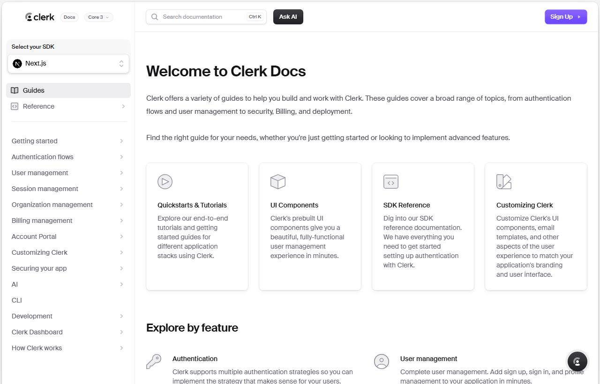
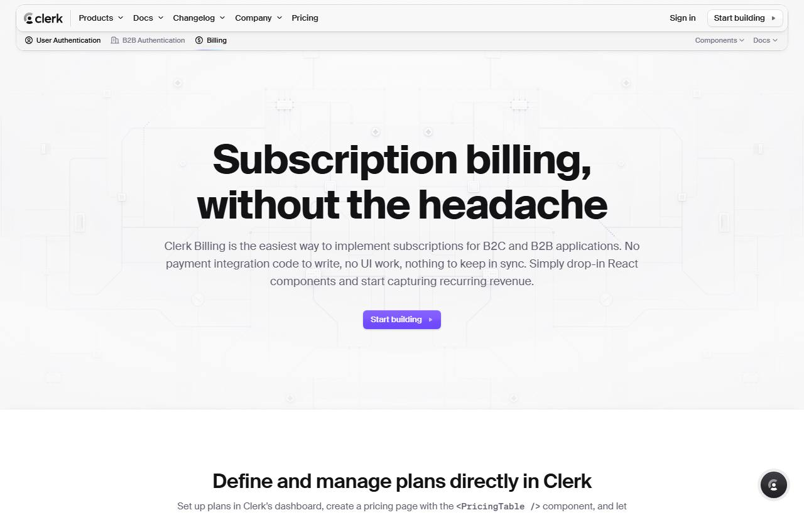
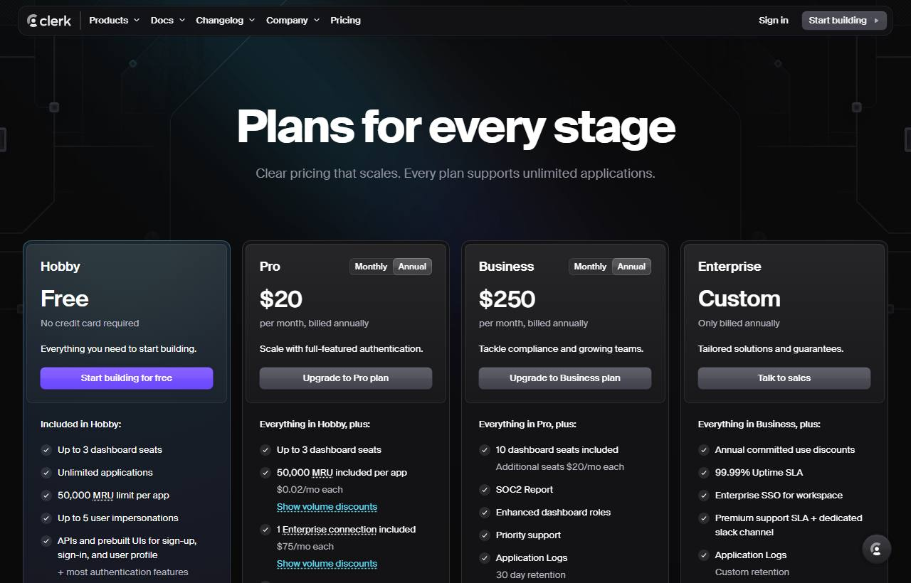
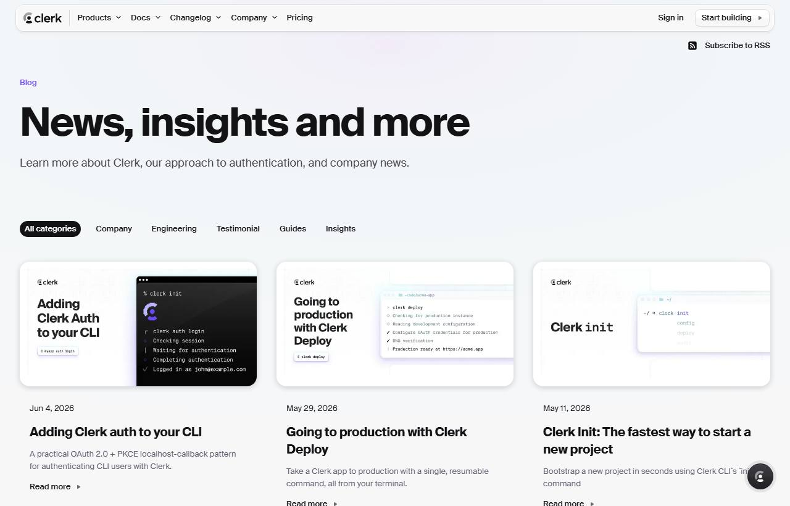
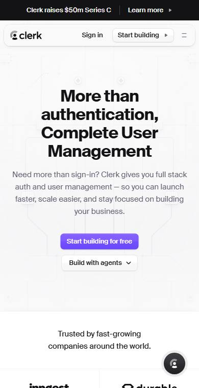

# Clerk Design Study — principles for a premium engineering portfolio

**A design-research dossier.** Why [clerk.com](https://clerk.com) feels premium, decoded from real screenshots and extracted CSS tokens, and translated into concrete, file-mapped moves for a calm, premium **personal engineering portfolio** — *not* another SaaS marketing site.

- **Subject:** clerk.com · **For:** mubin-attar.vercel.app
- **Method:** headless Chromium render (1280px) + computed-style extraction + first-hand visual audit
- **Captured:** July 2026
- **Visual version:** an interactive Artifact accompanies this doc (embedded screenshots, swatches, verdict matrices).
- **Not affiliated with Clerk.** This analyzes *principles* for adaptation, never reproduction. Clerk's brand, typeface (Suisse Int'l), and purple are its own.

**Verdict legend:** ✅ **Adopt** (use directly) · 🟡 **Adapt** (bend to an engineering portfolio) · ❌ **Avoid** (a SaaS pattern to skip).

---

## 1. Executive summary

Clerk feels expensive because of **restraint and craft, not decoration**. There is no gradient hero, no glassmorphism, no parallax. The premium feeling is manufactured by five disciplined decisions, repeated with near-religious consistency:

1. **Huge, tight display type** — 64px headings at **−1.6px** letter-spacing on a near-white ground. Big type set tight is the single strongest "expensive" signal.
2. **One accent, spent once** — a saturated purple `#6C47FF` appears on ~one element per view (the primary button). Everything else is greyscale.
3. **Tactile surfaces** — buttons/cards use a layered shadow recipe (hairline ring + 1px inset top-highlight + soft drop) so they feel physical, not flat.
4. **One motion curve** — almost every transition uses the same easing `cubic-bezier(.4,.36,0,1)`. Consistency, not quantity, reads as polish.
5. **Disciplined space** — a strict 1280 / 720px measure, one idea per viewport, generous padding.

**Where your portfolio stands:** you're already ~80% aligned with Clerk's *values* (light ground, single accent, evidence over hype, calm restraint). The gap is **craft depth** — surface tactility (you use hairlines only), type-scale drama, motion consistency, the "docs" calm. §16 closes that gap without importing a single SaaS-marketing pattern.


*The whole thesis in one screen: floating pill nav · slim announcement bar · 64px centered display at −1.6px tracking · muted subhead · exactly one purple CTA · a barely-there circuit-board texture.*

---

## 2. Design philosophy

**Confidence through restraint — the site behaves like a well-made instrument.** Polish is consistency; confidence is subtraction. Four principles carry it:

- **Spend boldness in exactly one place.** The type scale and a single accent are loud; everything else is deliberately quiet.
- **Make surfaces feel physical.** The shadow/ring recipe gives controls a pressable quality flat design can't fake.
- **One of everything.** One type family, one accent, one radius set (6/12px + pill), one easing. Reuse — not variety — reads as "one careful hand."
- **Docs are a design surface.** For a developer audience, the calm, structured docs page is where trust is actually won.

> **Translation for a personal engineering brand:** the site should feel like a precision tool you'd keep on your desk — quiet, tactile, exact — not a brochure trying to convert you.

---

## 3. UI audit

Clerk ships few distinct components, each reused everywhere. The signature is the **tactile surface recipe**, extracted verbatim from the primary button's computed `box-shadow`:

| Layer | Value (real) | What it does |
|---|---|---|
| Ring | `0 0 0 0.5px <color>` | A crisp hairline outline in the element's own colour. |
| Top highlight | `inset 0 1px 0 rgba(255,255,255,.07)` | A 1px inner light on the top edge — a lit, raised surface. |
| Soft drop | `0 1px 3px rgba(20,20,30,.2)` | A short, low shadow — grounds without floating. |

Cards add a wider ambient layer (`0 15px 35px -5px`) for menus/popovers. Every clickable thing looks pressable — the biggest single difference between Clerk's "premium" and a flat site.

**Inventory:** floating pill nav · mega-menu (icon+title+desc) · buttons · hairline line-icon cards · code chips & blocks · check-lists · segmented toggles · pill filters · version selector · ⌘K search · footer link matrix.

✅ **Adopt** the tactile recipe (in your palette) and hairline line-icon cards. ❌ **Avoid** the mega-menu scale — your nav is 3 items.

---

## 4. UX audit

One hierarchy unit — **eyebrow → display headline → muted subhead → single CTA** — repeated down every page. Because it never changes, your eye learns it once and coasts.

- **One idea per viewport.** Each screen states a single claim; density is low, you never triage.
- **Type sets hierarchy instantly.** The 64→18px jump tells you what matters before you read.
- **Muted body reduces strain.** Body copy is `#5E5F6E`, not black.
- **The accent is wayfinding.** Purple appears once, so the eye goes straight to the next action.
- **Marketing centers; editorial left-aligns.** Home/product center for impact; blog/docs switch to a left-aligned reading column — right for long text.

> **For your portfolio:** you already do "one idea per viewport." The upgrade is tightening the hierarchy unit so every section reads as the same instrument — and leaning editorial (left-aligned) everywhere, since a portfolio is *read*, not pitched.

---

## 5. Motion audit

Extracted from computed `transition` values. The finding: dozens of animated properties, but only ~two curves — overwhelmingly one refined ease-out. Uniform motion reads as "one careful hand."

| Interaction | Duration | Easing (real) | Why it exists |
|---|---|---|---|
| Button/link hover | 0.30s | `cubic-bezier(.4,.36,0,1)` | Colour + shadow settle; a soft "acknowledged," no bounce. |
| Larger surfaces | 0.45s | `cubic-bezier(.33,1,.68,1)` | easeOutCubic — bigger things move slower, feel weightier. |
| Accordion open | 0.20s | `cubic-bezier(0,0,.2,1)` | Animates `grid-template-rows: 0fr→1fr` — height without JS or jump. |
| Menu fade | 0.20s | `cubic-bezier(0,0,.2,1)` | Fast opacity+transform so menus feel instant. |
| Logo strip | ~1s loop | ease-in-out | Ambient auto-rotation. ❌ **Avoid** for a portfolio. |

No scroll-jacking, parallax, or typing effects. Motion is a *reaction*, not a performance. ✅ **Adopt** the one-curve rule and the grid-rows accordion. ❌ **Avoid** the looping logo carousel.

---

## 6. Typography

**Suisse Int'l** (premium Swiss grotesque) + **Geist** for numerals, at a dramatic scale with tight tracking.

| Role | Size | Weight | Tracking | Colour |
|---|---|---|---|---|
| Display (h1) | 64px / 72 lh | 700 | **−1.6px** | `#131316` |
| Eyebrow | 13px | 500 | normal | `#6C47FF` |
| Body / lede | 18px / 28 lh | 400 | normal | `#5E5F6E` |
| Numerals | Geist Mono | — | tabular | inherit |

The **negative tracking on large type** is the expensive signal — big text set tight looks composed; set loose it looks like a template.

🟡 **Adapt:** you don't need to license Suisse — your **Geist + Newsreader** pairing is excellent. Borrow the *scale drama and tight tracking*, not the typeface.

---

## 7. Spacing system

| Token | Value (extracted) | Use |
|---|---|---|
| Wide container | 1408 / 1280px | Page frame, nav, feature grids |
| Reading measure | 720px | Prose, docs body (~70 chars) |
| Section padding | ~96–140px vertical | Big air between ideas |
| Radii | 6px · 12px · pill | Controls · cards · toggles/avatars |

Grids are drawn with **hairline dividers** (the "trusted by" strip, docs cards), not gaps alone. ✅ **Adopt** the 1280/720 dual measure and the hairline-celled grid.

---

## 8. Color system

| Swatch | Hex | Role |
|---|---|---|
| Ground | `#F7F7F8` | Page background (near-white) |
| Ink | `#131316` | Headings |
| Muted body | `#5E5F6E` | Body text (grey with a *cool-purple bias*) |
| Border/quiet | `#9394A1` | Hairlines, quiet UI |
| Accent | `#6C47FF` | The one accent, ~one element per view |
| Dark section | `~#0C0D12` | A single strategic dark section (pricing) |

Two lessons: (1) **muted body isn't grey — it's grey biased toward the accent hue** (`#5E5F6E` leans cool-purple), which reads *chosen* not defaulted; (2) Clerk deploys **one dark section** as contrast — proof a light-first site can use a single dark "moment" for gravity.

🟡 **Adapt:** nudge your muted ink a hair toward the blue accent; consider exactly one dark section (your interactive architecture is the candidate), weighed against "light is the brand."

---

## 9. Component library

| Component | Clerk's pattern | Verdict |
|---|---|---|
| Button | Tactile ring + inset highlight + soft drop; 6px; 0.3s transition | ✅ Adopt |
| Card | Hairline, 12px, monochrome line-icon, bold title, muted line | ✅ Adopt |
| Nav | Floating pill bar + mega-menu | 🟡 Adapt (drop mega-menu) |
| Code chip / block | Mono in a subtle faint chip; framed block for multiline | ✅ Adopt |
| Segmented toggle | Pill with a sliding active state | 🟡 Adapt (before/after) |
| Pill filter | Category chips, active = filled pill | 🟡 Adapt (writing tags) |
| Checklist | Check glyph + item + muted sub-item | 🟡 Adapt (case-study specs) |
| Pricing table / toggle | Plan cards, value, CTA, feature list | ❌ Avoid |
| Testimonial / logo wall | Quote cards, auto-rotating logos | ❌ Avoid |

---

## 10. Navigation


*Mega-menu: soft-shadow rounded card; each item = rounded-square icon + bold title + muted description.*


*Docs — the gem: quiet left sidebar, ⌘K search, version selector, "Ask AI", a 4-card grid of monochrome line-icons. The calm engineering aesthetic to steal.*

Structure: slim dark **announcement bar** → **floating pill nav** (logo · text nav · Sign in · one filled CTA) → on product pages, a sticky **contextual sub-nav**. Docs swap this for a sidebar + persistent search.

🟡 **Adapt:** the floating-pill treatment and ⌘K search. ❌ **Avoid:** mega-menus, product sub-navs, "Sign in / Start building" CTAs — your nav is Work · Writing · About, and your assistant is already the one special button.

---

## 11. Page-by-page


*Product page: same hero recipe + sticky product sub-nav + inline `<PricingTable />` code chips.*


*Pricing (dark): a deliberate dark section — navy ground, faint radial glow, plan cards, segmented toggle. Contrast as emphasis.*


*Blog: eyebrow → big left-aligned display → pill category filter → 3-col cards with **illustrated terminal-mockup covers** (not stock photos) + date + title + excerpt + "Read more →".*


*Mobile: one column; sections alternate light/dark tone; the pill nav becomes a compact bar. Spacing and hierarchy survive the squeeze.*

- **Home** — centered marketing (logos, testimonials → ❌ Avoid).
- **Docs** — the calm, structured aesthetic most worth adopting.
- **Blog** — a card grid that maps almost 1:1 onto a portfolio's Writing/Work index.
- **Pricing/Careers** — layout study only.
- **Footer** — a quiet multi-column link matrix (Resources · Product · Company · Legal) on a faint ground.

---

## 12. Screenshots

All evidence is in [`./clerk-study/assets/`](./clerk-study/assets/): `fig-hero`, `fig-nav`, `fig-docs`, `fig-blog`, `fig-pricing`, `fig-billing`, `fig-mobile` (captured at 1280px via headless Chromium). The visual Artifact embeds them full-width with captions.

---

## 13. Animation references

Copy-paste curves — the real values:

```css
--ease: cubic-bezier(.4,.36,0,1);          /* signature ease-out */
--ease-cubic: cubic-bezier(.33,1,.68,1);   /* weightier surfaces */

/* hover */ transition: color .3s var(--ease), box-shadow .3s var(--ease);
/* accordion, no JS */ grid-template-rows: 0fr; transition: grid-template-rows .2s cubic-bezier(0,0,.2,1); /* →1fr open */
/* menu reveal */ transition: opacity .2s, transform .2s cubic-bezier(0,0,.2,1);
```

Your portfolio already declares `--ease-out: cubic-bezier(0.2,0,0,1)` — nearly identical intent. The move is to route *every* transition through it (§16).

---

## 14. Reusable patterns

- **The tactile surface recipe** — hairline ring + 1px inset highlight + soft drop. Highest-leverage upgrade.
- **The one-easing rule** — a single curve on every transition.
- **The hierarchy unit** — eyebrow → tight display → muted subhead → one action, repeated.
- **The hairline-celled grid** — structure drawn with 1px dividers, not just gaps.
- **The docs card** — monochrome line-icon + bold title + muted line, hairline, 12px.
- **The engineering post card** — an illustrated terminal/code cover instead of a photo.
- **Muted, accent-biased neutrals** — greys with a hint of the accent hue.

---

## 15. Things to avoid

Clerk is a company selling a product; you are a person showing work. Skip its sales scaffolding:

- ❌ Customer-logo walls & the auto-rotating logo carousel.
- ❌ Testimonials / quote cards.
- ❌ Pricing tables, plan toggles, "Talk to sales / Start building for free" CTAs.
- ❌ Enterprise copy ("Trusted by fast-growing companies", SOC2/SLA framing).
- ❌ Centered-everything marketing layout for long content — go editorial/left-aligned.
- ❌ Mega-menus & product sub-navs — you have three destinations.
- ❌ Heavy gradients, glows, or a dark default — your DESIGN §9 forbids it.

**Good news:** your portfolio already avoids every one of these. The risk isn't copying them — it's that a "make it like Clerk" instinct could smuggle them in. Don't.

---

## 16. Recommendations for your portfolio — the payoff

Every principle mapped to a real file in `mubin-attar.vercel.app`, tagged and prioritized. Implement on your go.

| Move | Verdict | File(s) | Change | Priority |
|---|---|---|---|---|
| **Tactile surface recipe** | 🟡 Adapt | `styles/tokens.css` · `globals.css` | Add a refined multi-layer shadow token (hairline ring + inset top-highlight + soft drop) for the primary button, cards, and the assistant panel. You use hairlines only — the single biggest "premium" jump. | **High** |
| **One-easing everywhere** | ✅ Adopt | `styles/tokens.css` · `globals.css` | Route *every* transition through `--ease-out`; audit hover/underline/reveal to one curve + a 2-tier duration (150ms micro, 300ms surface). | **High** |
| **Display scale + tracking** | 🟡 Adapt | `styles/tokens.css` · `app/page.tsx` | Tighten hero tracking (toward −0.03em), push one display size larger. Keep Geist + Newsreader — borrow the drama, not Suisse. | Med |
| **Accent-biased neutrals** | 🟡 Adapt | `styles/tokens.css` | Nudge `--color-ink-secondary/tertiary` a hair toward the blue accent so greys read "chosen." Re-run the a11y gate. | Med |
| **Docs-style card grid** | ✅ Adopt | `components/ui/card.tsx` · `app/work` | A hairline, 12px, monochrome-line-icon card (title + muted line) for the Work index or a "How I build" grid. Calm, engineering-credible. | Med |
| **⌘K command palette** | 🟡 Adapt | `components/features/assistant.tsx` | You open the assistant with `/`; add ⌘K as a second, more-expected shortcut + a hint in the trigger. | Med |
| **Engineering post covers** | 🟡 Adapt | `app/writing` · `content/writing` | Give essays a subtle generated terminal/diagram cover motif (SVG, on-brand) instead of nothing. | Low |
| **One dark "moment"** | 🟡 Adapt | `app/page.tsx` (architecture) | Optional: render the interactive architecture on a single dark band for gravity. Weigh vs "light is the brand" — prototype first. | Low |
| **Segmented toggle / checklist** | 🟡 Adapt | `components/case-studies/*` | Segmented control for before/after; check-list for "what shipped." | Low |
| **Logo walls · testimonials · pricing · sales CTAs** | ❌ Avoid | — | Already absent. Keep it that way — these break the "personal engineer" frame. | — |

> **Bottom line:** you don't need a redesign — you're already in Clerk's calm/light/one-accent territory. Three **High-priority craft moves** (tactile surfaces, unified easing, tighter display type) close most of the perceived-quality gap. Everything else is optional polish, and every SaaS-marketing pattern stays out.
